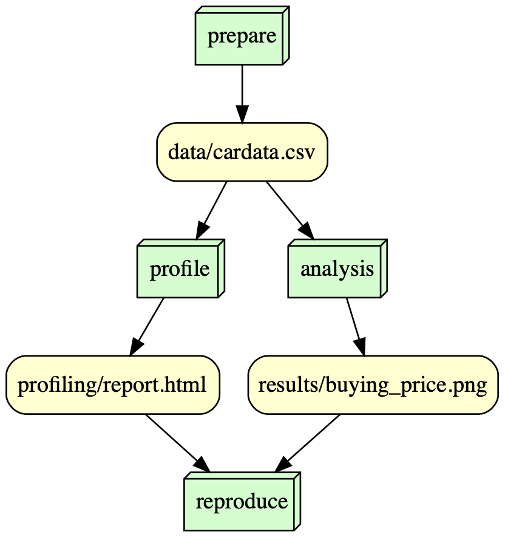

# is477-fall2023-final-project

# Overview 

The Car Evaluation Database, assesses car acceptability based on attributes like buying price, maintenance cost, technical characteristics, comfort, and safety. It summarizes the dataset by directly correlating car acceptability (CAR) with six input attributes: buying, maint, doors, persons, lug_boot, and safety. This database is ideal for research in constructive induction and structure discovery due to its known underlying concept structure.

My goal in this project was to analyze the Car Evaluation Database to uncover insights into what factors most significantly influence a car's acceptability. I focused on visualizing the data to better understand the distribution and relationship of these attributes.

# Analysis 
The analysis, centered around the car eval dataset, produced significant findings, particularly in the realm of buying price preferences. The visualizatiosn shows the range of buying prices were about equal in the dataset.

# Workflow 

 

# Reproducing 
1. environment is as such:
Product Name:            macOS
Product Version:         13.0.1
Build Version:           22A400
Python Version:          Python 3.11.5

2. The following dependencies need to be installed: pip install -r requirements.txt

3. Run these scripts in the following order to set up the environment properly:
python scripts/prepare_data.py
python scripts/profile.py
python scripts/analysis.py
python scripts/dag.py

# License 
MIT License for software license and Creative Commons Attribution 4.0 License, CC-BY-4.0, for data license.

## References
Bohanec, M. (1997). Car Evaluation. UCI Machine Learning Repository. https://doi.org/10.24432/C5JP48.b 
